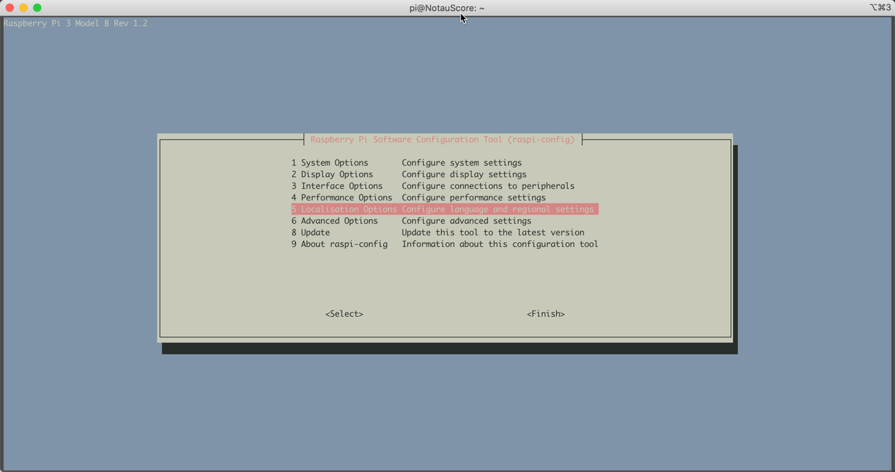
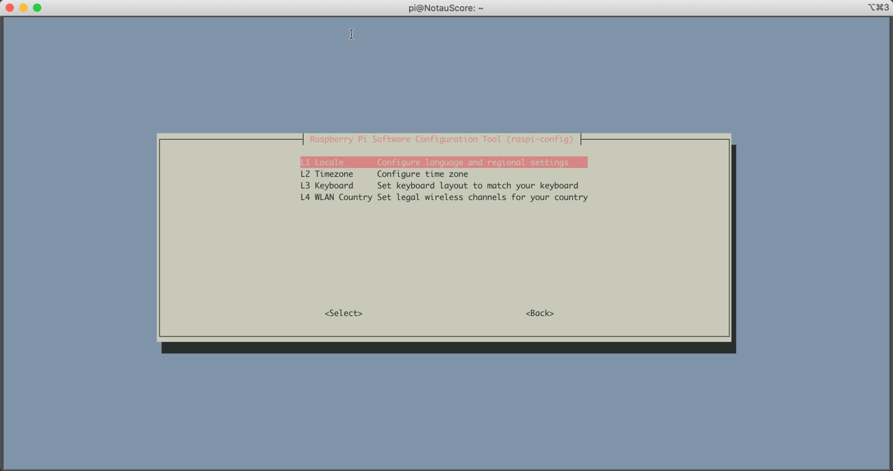
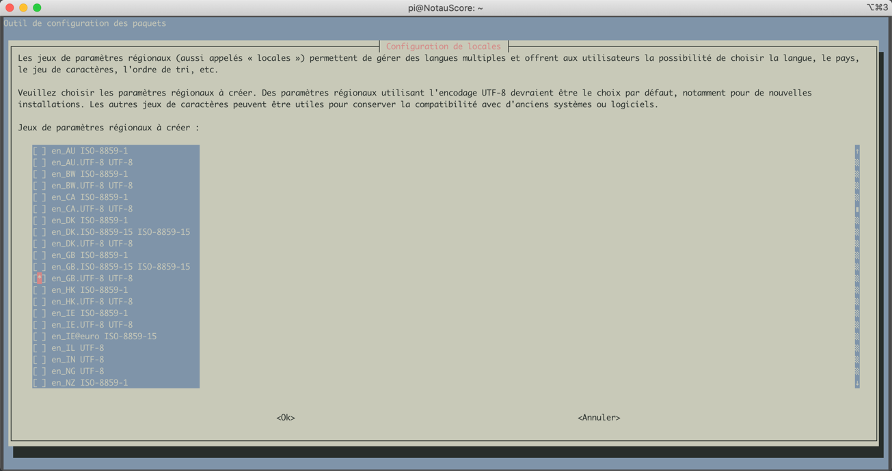
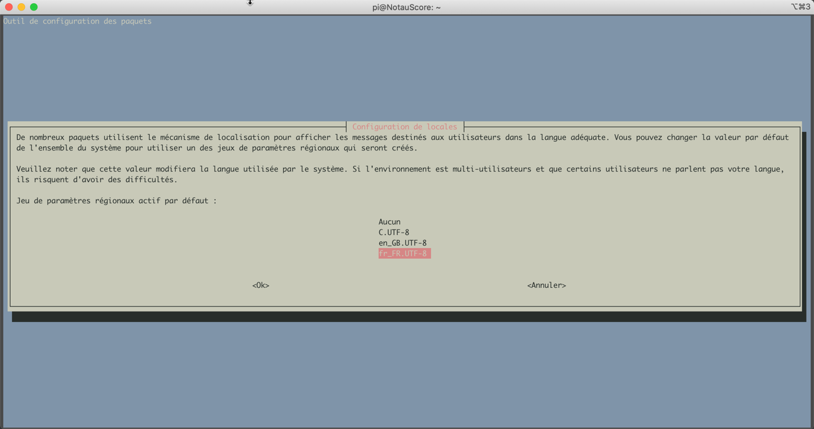
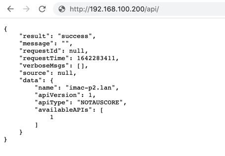
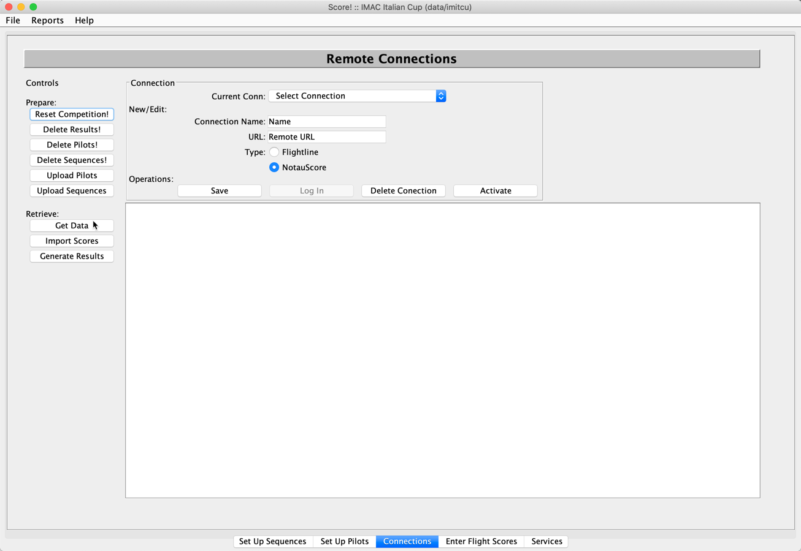
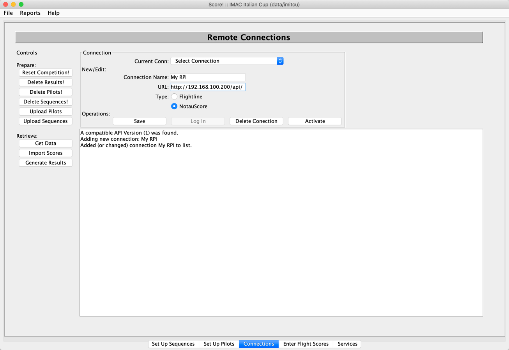
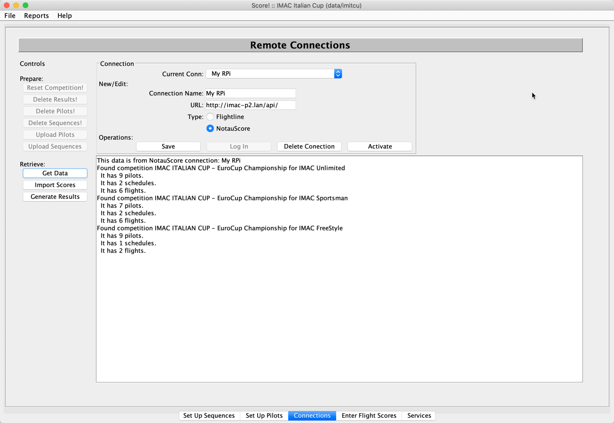
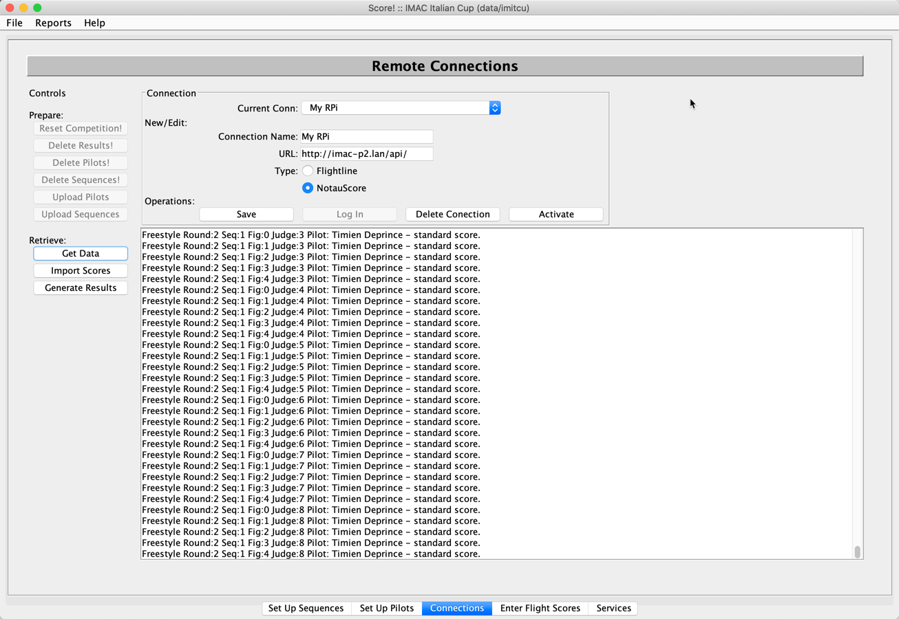

# Prepping a new NotauScore image for use in IMAC.

## Introduction

This document will descibe how to set up a NotauScore image with some useful local settings..

## Installing the image

Please follow instructions from NotauScore to install the image on a SD card for the raspberry pi.

## Booting and logging in for the first time

Attach to the **ffam-notaumatic** WIFI point using password **citamuaton** password.

SSH to the following address:

```
$ ssh pi@192.168.100.200
pi@192.168.100.200's password:
Linux NotauScore 5.10.17-v7+ #1421 SMP Thu May 27 13:59:01 BST 2021 armv7l

The programs included with the Debian GNU/Linux system are free software;
the exact distribution terms for each program are described in the
individual files in /usr/share/doc/*/copyright.

Debian GNU/Linux comes with ABSOLUTELY NO WARRANTY, to the extent
permitted by applicable law.
Last login: Thu Aug  5 21:43:28 2021 from 192.168.100.145
pi@NotauScore:~ $
```

You are logged in as pi.    

## Changing the localisation settings (Optional)

When the system is created, it's set up for French azerty keyboards.    You can leave these as is, if you prefer, however, please be aware than when you connect to the rPi with a keboard and monitor, the keymap will be azerty.

OS Local errors will also be in French.

These next steps are purely optional, and, please keep in mind if you do this, you will likely need to reset the admin password on the 

Change to the root user and adjust the localisations settings.  You can do this will the following commands:

```
pi@NotauScore:~ $ sudo su -
root@NotauScore:~# raspi-config
```



Select "5 Localisation Options"


Select "L1 Locale"


Scroll down (down arrow or CTRL-V for pagedown) and make sure "en_GB.UTF-8" is selected.
Keep scrolling and make sure "fr_FR.UTF-8" is NOT selected.
Then use the tab key to select "Ok" and hit enter.


The next page sets the default.   Make sure it's also set to en_GB.UTF-8.
Select it and hit enter.

You will see something like this in your terminal window:
```
root@NotauScore:~# raspi-config
Generating locales (this might take a while)...
  en_GB.UTF-8... done
Generation complete.
```

Next, select the "L2 Timezone" option and hit enter.
Select the appropriate timezone for you.

Lastly, go back into the menu and select "L3 Keyboard" and hit enter.
There are no options for this one.   It will reconfigure your keyboard automatically.

## Adjust network settings for DHCP with fallback (Optional)

As configured, the NotauScore image has static addresses for the wifi and ethernet ports.

If your local network does not match the static IP subnet  you might wish to instead try DHCP first and then fall back to the default address.   This means at home, you can access the NotauScore system easily on a local IP address (without having to use the NotauScore wifi) and at the field, you can connect directly to the NotauScore via a local cable.

You can choose to use a local DHCP server, but have a fallback for when DHCP is unavailable.
Edit the /etc/dhcpcd.conf file and change the following at the end of the file:

```
# Example static IP configuration:
interface eth0
static ip_address=192.168.200.200/24
#static ip6_address=fd51:42f8:caae:d92e::ff/64
#static routers=192.168.100.1
#static domain_name_servers=192.168.100.1

# It is possible to fall back to a static IP if DHCP fails:
# define static profile
#profile static_eth0
#static ip_address=192.168.1.23/24
#static routers=192.168.1.1
#static domain_name_servers=192.168.1.1

# fallback to static profile on eth0
#interface eth0
#fallback static_eth0
interface wlan0
static ip_address=192.168.100.200/24
static routers=192.168.100.1
static domain_name_servers=8.8.8.8
nohook wpa_supplicant
```

Should read:
```
# Example static IP configuration:
#interface eth0
#static ip_address=192.168.200.200/24
#static ip6_address=fd51:42f8:caae:d92e::ff/64
#static routers=192.168.100.1
#static domain_name_servers=192.168.100.1

# It is possible to fall back to a static IP if DHCP fails:
# define static profile
profile static_eth0
static ip_address=192.168.200.200/24
#static ip_address=192.168.1.23/24
#static routers=192.168.1.1
#static domain_name_servers=192.168.1.1

# fallback to static profile on eth0
interface eth0
fallback static_eth0
interface wlan0
static ip_address=192.168.100.200/24
static routers=192.168.100.1
static domain_name_servers=8.8.8.8
nohook wpa_supplicant
```

In the first paragraph, two lines are commented.
In the second one, we uncomment 1 line and add a static ip line.
In the third paragraph, we uncomment the eth0 definition and the line after it.   This prompts the networking system to try DHCP first and fallbacl to the static profile.

## Configure the Apache Webserver ##
There are several things that need to happe for the api to work.
First off, a config directive allowing .htacess override to work needs to be created/installed.

In the directory /etc/apache2/conf-available create a file called notauscore-api.conf.
It should have the following contents.

```
<Directory /var/www/html/api>
Options Indexes FollowSymLinks
AllowOverride FileInfo
Require all granted
</Directory>
```

The allows the API to do some redirecting and work with pathname URLs.

To enable this config, you need to create a link to it in the /etc/apache2/conf-enabled directory.

At the same time we need to enable the rewrite module for apache.
The following commands will achieve this.
1. Enable rewrite
    ```
    pi@NotauScore:~ $ sudo a2enmod rewrite
    Enabling module rewrite.
    To activate the new configuration, you need to run:
     systemctl restart apache2
    ```
1. Enable notauscore api
    ```
    pi@NotauScore:~ $ sudo a2enconf notauscore-api
    Enabling conf notauscore-api.
    To activate the new configuration, you need to run:
     systemctl reload apache2
    ```
1. Restart apache2
    ```
    pi@NotauScore:~ $ sudo systemctl reload apache2
    pi@NotauScore:~ $
    ```


## Copy the API files

Next we must copy the API files to the web directory.

First, download the archive.   It can be found at : https://imac.org.au/Score/notauscore-api/
The latest version is here: https://imac.org.au/Score/notauscore-api/notauscore-api-latest.zip

```
pi@NotauScore:~ $ cd /var/www/html/
pi@NotauScore:/var/www/html $ wget https://imac.org.au/Score/notauscore-api/notauscore-api-latest.zip
--2022-01-15 22:44:49--  https://imac.org.au/Score/notauscore-api/notauscore-api-latest.zip
Résolution de imac.org.au (imac.org.au)… 54.252.129.118
Connexion à imac.org.au (imac.org.au)|54.252.129.118|:443… connecté.
requête HTTP transmise, en attente de la réponse… 200 OK
Taille : 43427 (42K) [application/zip]
Sauvegarde en : « notauscore-api-latest.zip »

notauscore-api-latest.zip                                    100%[==============================================================================================================================================>]  42,41K  --.-KB/s    ds 0,05s

2022-01-15 22:44:50 (933 KB/s) — « notauscore-api-latest.zip » sauvegardé [43427/43427]
pi@NotauScore:/var/www/html $

```


Next, extract it.

```
pi@NotauScore:/var/www/html $ unzip notauscore-api-latest.zip
Archive:  notauscore-api-latest.zip
   creating: api/
  inflating: api/index.php
   creating: api/include/
   creating: api/include/KLogger/
  inflating: api/include/KLogger/Logger.php
   creating: api/include/flight/
  inflating: api/include/flight/autoload.php
  inflating: api/include/flight/Engine.php
   creating: api/include/flight/net/
  inflating: api/include/flight/net/Response.php
  inflating: api/include/flight/net/Request.php
  inflating: api/include/flight/net/Route.php
  inflating: api/include/flight/net/Router.php
   creating: api/include/flight/core/
  inflating: api/include/flight/core/Loader.php
  inflating: api/include/flight/core/Dispatcher.php
   creating: api/include/flight/util/
  inflating: api/include/flight/util/Collection.php
   creating: api/include/flight/template/
  inflating: api/include/flight/template/View.php
  inflating: api/include/flight/Flight.php
   creating: api/include/Psr/
   creating: api/include/Psr/Log/
  inflating: api/include/Psr/Log/LoggerAwareInterface.php
  inflating: api/include/Psr/Log/LogLevel.php
   creating: api/include/Psr/Log/Test/
  inflating: api/include/Psr/Log/Test/LoggerInterfaceTest.php
  inflating: api/include/Psr/Log/Test/TestLogger.php
  inflating: api/include/Psr/Log/Test/DummyTest.php
  inflating: api/include/Psr/Log/LoggerAwareTrait.php
  inflating: api/include/Psr/Log/InvalidArgumentException.php
  inflating: api/include/Psr/Log/NullLogger.php
  inflating: api/include/Psr/Log/LoggerInterface.php
  inflating: api/include/Psr/Log/LoggerTrait.php
  inflating: api/include/Psr/Log/AbstractLogger.php
   creating: api/1/
  inflating: api/1/functions.php
  inflating: api/1/index.php
  inflating: api/1/api_functions.php
  inflating: api/error.php
  inflating: api/.htaccess

pi@NotauScore:/var/www/html $ sudo chown -R www-data:www-data api

pi@NotauScore:/var/www/html $ ls -als api
total 44
 4 drwxr-xr-x  4 www-data www-data  4096 août  28 13:59 .
20 drwxrwx--- 32 pi       www-data 20480 janv. 15 22:45 ..
 4 drwxr-xr-x  2 www-data www-data  4096 sept. 11 18:58 1
 4 -rw-r--r--  1 www-data www-data  1951 mars   6  2021 error.php
 4 -rw-r--r--  1 www-data www-data   417 mars   1  2021 .htaccess
 4 drwxr-xr-x  5 www-data www-data  4096 févr. 27  2021 include
 4 -rw-r--r--  1 www-data www-data   815 août  28 13:59 index.php

pi@NotauScore:/var/www/html $ rm notauscore-api-latest.zip
```

You should be able to access the API now.
Test at : http://<notauscore ip>/api/

A sucessful installation will look something like this:


## Enter the API into Score

Lastly, you must enter the API URL into score.  Please make sure you are using score dated version 2021-12-04 or later.
The URL to use will be:   http://<notauscore ip>/api/ 
The API Type is: 'NotauScore'

In Score, select the 'Connections' tab.




To create a new connection, enter a new name and the URL.
Ensure '**Type**' is set to NotauScore and then click '**Save**'



You should see the message above that the connection was added.
Please note, the "Activate" and "Log in" buttons do not do anything currently.
Delete connection will be used to remove the NotauScore connection from the list.

### Before the competition

Now, you can select the connection from the list.    

Start a new competion with 0 pilots and 0 sequences.    The Score program will download these from the NotauScore webpage via the API.

### Download latest scores

To get the latest data (sequences, pilots and scores), with the right connection selected, click on 'Get Data'.


You can see that Score has downloaded pilots for 2 classes comps and the freestyle comp.

It was also able to get the schdules (sequences) and score (flight) data for these comps.

Before any of this data is visible within score, you must import it, by clicking on the "Import Scores" button.

This step can take a long time.   So please be patient.
In the future I will add a progress indicator to the system to show how it's going.



The score data should now be present...
You can click 'Generate Results' to get a html result of the competition.
