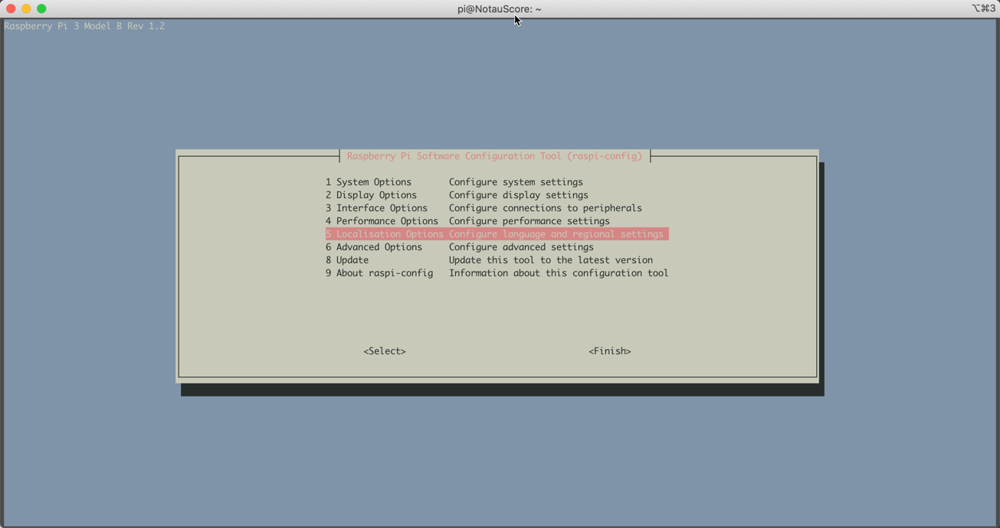
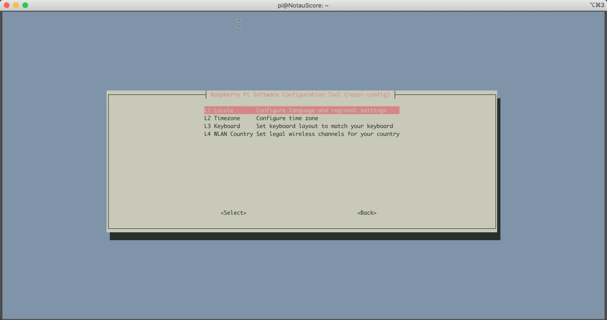
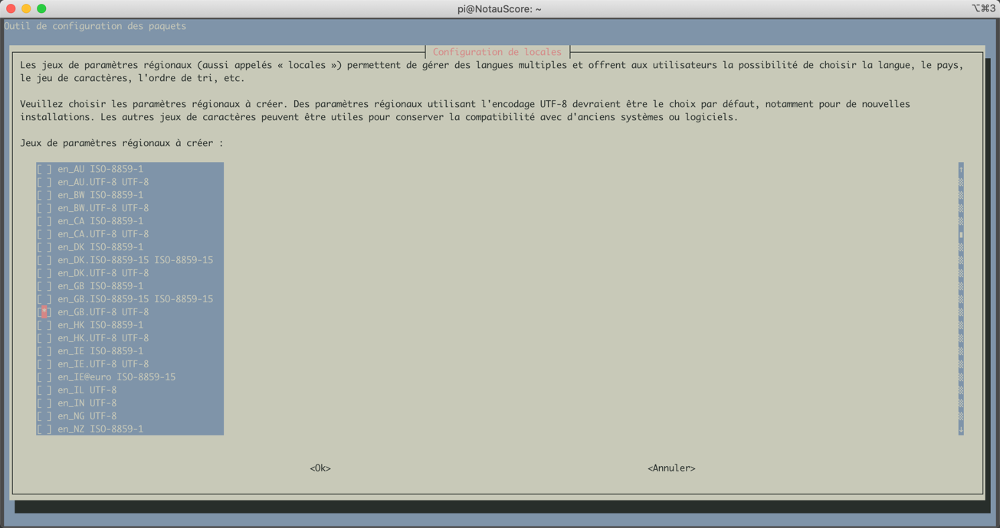
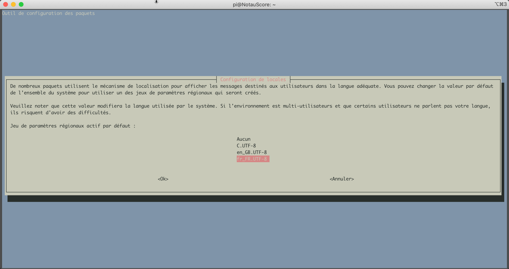

# Prepping a new NotauScore image for use in IMAC.

#### Introduction

This document will descibe how to set up a NotauScore image with some useful local settings..

#### Installing the image

ToDo

#### Booting and logging in for the first time

WHen the system is created, it's set up for French azerty keyboards.    The easiest thing to do is connect via wifi and reconfigure it.

Attach to the **ffam-notaumatic** WIFI point using password **citamuaton** password.

SSH to the following address:

```
$ ssh pi@192.168.100.200
pi@192.168.100.200's password:
Linux NotauScore 5.10.17-v7+ #1421 SMP Thu May 27 13:59:01 BST 2021 armv7l

The programs included with the Debian GNU/Linux system are free software;
the exact distribution terms for each program are described in the
individual files in /usr/share/doc/*/copyright.

Debian GNU/Linux comes with ABSOLUTELY NO WARRANTY, to the extent
permitted by applicable law.
Last login: Thu Aug  5 21:43:28 2021 from 192.168.100.145
pi@NotauScore:~ $
```

You are logged in as pi.    Change to the root user and adjust the localisations settings.  You can do this will the following commands:

```
pi@NotauScore:~ $ sudo su -
root@NotauScore:~# raspi-config
```



Select "5 Localisation Options"


Select "L1 Locale"


Scroll down (down arrow or CTRL-V for pagedown) and make sure "en_GB.UTF-8" is selected.
Keep scrolling and make sure "fr_FR.UTF-8" is NOT selected.
Then use the tab key to select "Ok" and hit enter.


The next page sets the default.   Make sure it's also set to en_GB.UTF-8.
Select it and hit enter.

You will see something like this in your terminal window:
```
root@NotauScore:~# raspi-config
Generating locales (this might take a while)...
  en_GB.UTF-8... done
Generation complete.
```

Next, select the "L2 Timezone" option and hit enter.
Select the appropriate timezone for you.

Lastly, go back into the menu and select "L3 Keyboard" and hit enter.
There are no options for this one.   It will reconfigure your keyboard automatically.

Using DHCP for local ethernet with a fallback.
You can choose to use a local DHCP server, but have a fallback for when DHCP is unavailable.
Edit the /etc/dhcpcd.conf file and change the following at the end of the file:

```
# Example static IP configuration:
interface eth0
static ip_address=192.168.200.200/24
#static ip6_address=fd51:42f8:caae:d92e::ff/64
#static routers=192.168.100.1
#static domain_name_servers=192.168.100.1

# It is possible to fall back to a static IP if DHCP fails:
# define static profile
#profile static_eth0
#static ip_address=192.168.1.23/24
#static routers=192.168.1.1
#static domain_name_servers=192.168.1.1

# fallback to static profile on eth0
#interface eth0
#fallback static_eth0
interface wlan0
static ip_address=192.168.100.200/24
static routers=192.168.100.1
static domain_name_servers=8.8.8.8
nohook wpa_supplicant
```

Should read:
```
# Example static IP configuration:
#interface eth0
#static ip_address=192.168.200.200/24
#static ip6_address=fd51:42f8:caae:d92e::ff/64
#static routers=192.168.100.1
#static domain_name_servers=192.168.100.1

# It is possible to fall back to a static IP if DHCP fails:
# define static profile
profile static_eth0
static ip_address=192.168.100.200/24
#static ip_address=192.168.1.23/24
#static routers=192.168.1.1
#static domain_name_servers=192.168.1.1

# fallback to static profile on eth0
interface eth0
fallback static_eth0
interface wlan0
static ip_address=192.168.100.200/24
static routers=192.168.100.1
static domain_name_servers=8.8.8.8
nohook wpa_supplicant
```

In the first paragraph, two lines are commented.
In the second one, we uncomment 1 line and add a static ip line.
In the third paragraph, we uncomment the eth0 definition and the line after it.   This prompts the networking system to try DHCP first and fallbacl to the static profile.

#### Configure the Apache Webserver. ####
There are several things that need to happe for the api to work.
First off, a config directive allowing .htacess override to work needs to be created/installed.

In the directory /etc/apache2/conf-available create a file called notauscore-api.conf.
It should have the following contents.

```
<Directory /var/www/html/api>
Options Indexes FollowSymLinks
AllowOverride FileInfo
Require all granted
</Directory>
```

The allows the API to do some redirecting and work with pathname URLs.

To enable this config, you need to create a link to it in the /etc/apache2/conf-enabled directory.

At the same time we need to enable the rewrite module for apache.
The following commands will achieve this.
1. Enable rewrite
    ```
    pi@NotauScore:~ $ sudo a2enmod rewrite
    Enabling module rewrite.
    To activate the new configuration, you need to run:
     systemctl restart apache2
    ```
1. Enable notauscore api
    ```
    pi@NotauScore:~ $ sudo a2enconf notauscore-api
    Enabling conf notauscore-api.
    To activate the new configuration, you need to run:
     systemctl reload apache2
    ```
1. Restart apache2
    ```
    pi@NotauScore:~ $ sudo systemctl reload apache2
    pi@NotauScore:~ $
    ```


